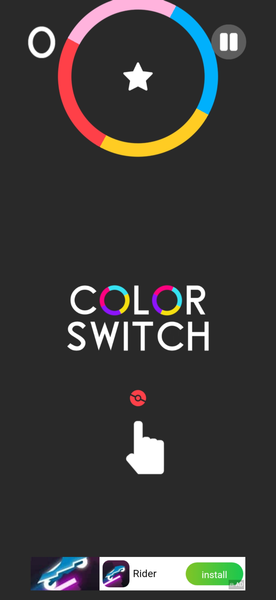

# Color Switch

## Présentation

Colors switch est un jeu mobile de type **arcade** développé par l'équipe **[Color Switch Phoenix LLC](https://colorswitch.co/about)**.

Voici la description du jeux dans toute les plateformes de téléchargement :

> Avec 200 millions de téléchargements et cela continue, Color Switch a été le 
> jeu le plus rapide dans l'histoire de l'App Store à atteindre 50 millions de 
> téléchargements et a été le jeu n°1 dans plus de 150 pays. Avec cette nouvelle 
> version de Color Switch, nous vous offrons encore plus de mini-jeux, de musique,
> et de nouvelles fonctionnalités passionnantes jamais vues auparavant.

Cela indique la popularité qu'a eu ce jeu.

## Les règles du jeux

Les règles du jeux sont simple.  
Le but est arriver à la ligne d'arriver en passant les obstacles.  
Pour pouvoir traverser un obstacle, il faut qu'il soit de la même couleur que la balle.  
A chaque toucher sur l'écran, la balle fait un petit saut.  
La balle peut changer de couleur en touchant des cercles spéciaux.  

  

Durant la partie Nous pouvons récupérer des étoiles servant de monnaie dans le jeux pour pouvoir débloquer d'autre styles de balles.

  

## Règles récupérée ou adaptée  

Je vais principalement garder les même règles que le jeux d'origine.  
Il est vrai que le jeux possède une petite quinzaine de mode de jeux différents, cepandant,
Je vais réaliser le mode classique expliquer ci-dessus.

## To Do list  
- [X] réaliser le fond  
- [ ] dessiner les obstacles  
- [ ] dessiner la balle  
- [ ] gérer les collisions  
- [ ] permettre le changement de couleur
- [ ] ajouter des petite étoiles

(Il y a encore du bouleau :sweat_smile: )